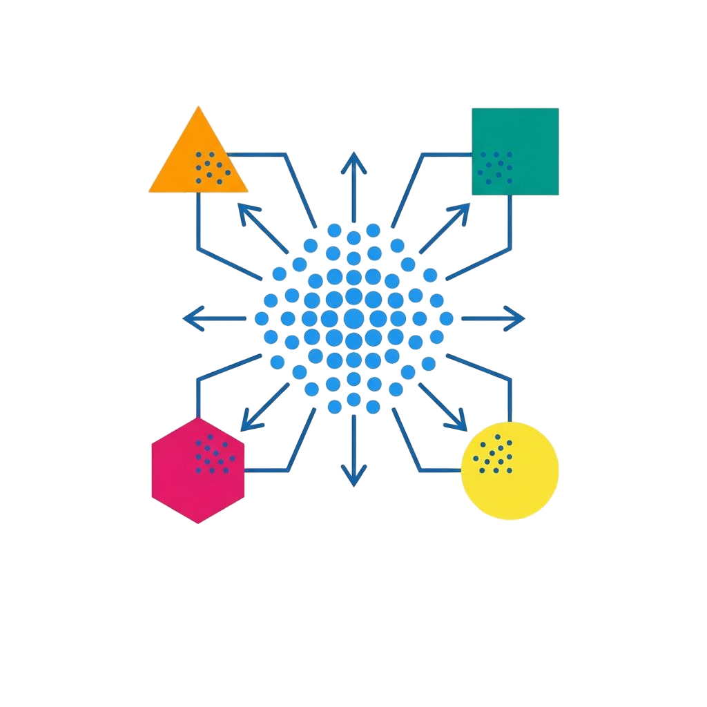

  
    <picture>
      <source media="(prefers-color-scheme: dark)" srcset="assets/logo_full.jpg" width="200px">
      <source media="(prefers-color-scheme: light)" srcset="assets/logo_full.jpg" width="200px">
      
    </picture>
    <h1> DataMetaMap </h1>
    
 Datasetes vector representation 

    
    
    
    

"DataMetaMap" is Python library designed to represent various multiple datasets in the same vector space for comparision them with each other. Library is offering a suite of advanced datasete embedding techniques compatible with PyTorch.

## 📬 Assets

1. [Technical Meeting 1 - Presentation](https://github.com/intsystems/DataMetaMap/blob/master/assets/BMM_technical_1.pdf)

## 💡 Motivation
We need an ability to compare information similarity between various datasets. If so, we can find the most similar dataset to our target task dataset. Choosing the best pretrain neural net on it can narrow down the choice of potential candidates for pretrain. 

## 🗃 Algorithms
- [x] Maximum Mean Discrepancy, also see [📝 review](https://arxiv.org/abs/1605.09522) 
- [x] Task2Vec, also see [📝 paper](https://arxiv.org/pdf/1902.03545)
- [x] Dataset2Vec, also see [📝 paper](https://arxiv.org/pdf/1905.11063) 
- [x] Wasserstein Task Embedding, also see [📝 paper](https://arxiv.org/pdf/2208.11726) 

## 🛠️ Install

TODO

## 🚀 Quickstart 
TODO

## 🎮 Demo
TODO

## 📚 Stack
TODO
  
## 🧩 Some details
TODO

## 👥 Contributors
- [Vladislav Minashkin](https://github.com/minashkinvladislav) (Project planning, Benchmarking, Algorithms)
- [Papay Ivan](https://github.com/papayiv) (Documentation writing, Code writing, Algorithms)
- [Meshkov Vlad](https://github.com/VseMeshkov) (Blog post, Demo, Algorithms)
- [Stepanov Ilya](https://github.com/ILIAHHne63) (Tech. report, Code writing, Algorithms)
- You are welcome to contribute to our project!

## 🔗 Useful links
Пока что тут ничего нет
