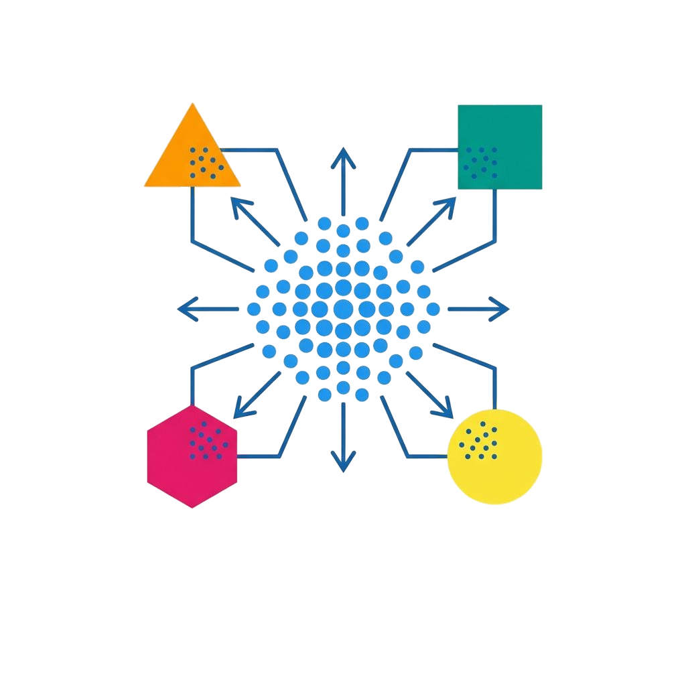

<div align="center">  
    <picture>
      <source media="(prefers-color-scheme: dark)" srcset="assets/logo_full.jpg" width="400px">
      <source media="(prefers-color-scheme: light)" srcset="assets/logo_full.jpg" width="400px">
      
    </picture>
    <h1> DataMetaMap </h1>
    <p align="center">Datasets in a shared vector space</p>
</div>

<p align="center">
    <a href="https://github.com/intsystems/DataMetaMap/tree/develop/tests">
        
    </a>
    <a href="https://github.com/intsystems/DataMetaMap/tree/develop/tests">
        
    </a>
    <a href="https://intsystems.github.io/DataMetaMap">
        
    </a>
</p>

<p align="center">
    <a href="https://github.com/intsystems/DataMetaMap/blob/main/LICENSE">
        
    </a>
    <a href="https://github.com/intsystems/DataMetaMap/graphs/contributors">
        
    </a>
    <a href="https://github.com/intsystems/DataMetaMap/issues">
        
    </a>
    <a href="https://github.com/intsystems/DataMetaMap/pulls">
        
    </a>
</p>

DataMetaMap is a Python library for representing datasets in a shared vector space, so you can compare datasets (and tasks) using standard distances and similarity metrics.

It includes multiple dataset embedding algorithms implemented on top of PyTorch:
- Dataset2Vec (tabular datasets)
- Task2Vec (supervised tasks via Fisher information)
- Wasserstein Task Embedding (Optimal Transport based)
- MMD (used as a baseline in some workflows)

## 📬 Assets

1. [Technical Meeting 1 - Presentation](https://github.com/intsystems/DataMetaMap/blob/master/assets/BMM_technical_1.pdf)
2. [Blog Post](https://github.com/intsystems/DataMetaMap/edit/meshkovvl/BLOGPOST.md)
3. [Technical Report](https://github.com/intsystems/DataMetaMap/blob/develop/report/data_meta_map.pdf)


## 💡 Motivation
If you can measure similarity between datasets, you can:
- retrieve the most similar dataset(s) to a target dataset
- choose better pretraining sources
- cluster tasks and datasets, and visualize the dataset landscape
- track dataset drift over time

## 🗃 Algorithms
- [x] Maximum Mean Discrepancy, also see [📝 review](https://arxiv.org/abs/1605.09522) 
- [x] Task2Vec, also see [📝 paper](https://arxiv.org/pdf/1902.03545)
- [x] Dataset2Vec, also see [📝 paper](https://arxiv.org/pdf/1905.11063) 
- [x] Wasserstein Task Embedding, also see [📝 paper](https://arxiv.org/pdf/2208.11726) 


## 🛠️ Install

Requires Python 3.10+.

### Virtual Environment (venv)

Recommended: install into an isolated virtual environment.

macOS / Linux:

```bash
python3 -m venv .venv
source .venv/bin/activate
python -m pip install -U pip
```

Windows (PowerShell):

```powershell
py -m venv .venv
.\.venv\Scripts\Activate.ps1
py -m pip install -U pip
```

### Install from source

```bash
git clone https://github.com/intsystems/DataMetaMap.git
cd DataMetaMap
python -m pip install .
```

### Development install (editable + dev dependencies)

```bash
python -m pip install -e ".[dev,viz]"
```

## 🚀 Quickstart

### Dataset2Vec (tabular)

`Dataset2VecEmbedder` trains on a collection of tabular datasets, then embeds a single dataset as a vector.

```python
import numpy as np
import torch

from data_meta_map.models import get_model
from data_meta_map.dataset2vec_embedder import Dataset2VecEmbedder

# Model for tabular embedding
model = get_model("dataset2vec")
embedder = Dataset2VecEmbedder(model, max_epochs=1, batch_size=8, n_batches=5)

# Each training dataset: last column is the target
train_ds1 = np.random.randn(64, 6).astype(np.float32)
train_ds2 = np.random.randn(64, 6).astype(np.float32)
embedder.fit([train_ds1, train_ds2])

X = torch.randn(32, 5)
y = torch.randint(0, 2, (32,)).float()
z = embedder.embed(X, y)
print(z.shape)  # (output_size,)
```

### Wasserstein Task Embedding (PyTorch Dataset / DataLoader)

`WassersteinEmbedder` can compute class statistics from a dataset and build embeddings via a distance matrix.
See [demo/wasserstein/simple_example1 (1).ipynb](demo/wasserstein/simple_example1%20(1).ipynb) for an end-to-end notebook.

### Task2Vec (supervised tasks)

Task2Vec computes a task embedding based on the Fisher information of a probe network.
See [demo/task2vec/simple_example.ipynb](demo/task2vec/simple_example.ipynb) for an example workflow.

## 🎮 Demo
Notebooks are in:
- [demo/dataset2vec/simple_example.ipynb](demo/dataset2vec/simple_example.ipynb)
- [demo/task2vec/simple_example.ipynb](demo/task2vec/simple_example.ipynb)
- [demo/wasserstein/simple_example1 (1).ipynb](demo/wasserstein/simple_example1%20(1).ipynb)

## 📈 Benchmarks

Benchmark notebooks and scripts live in [benchmarks/](benchmarks). In particular, see [benchmarks/pretrain_benchmark/](benchmarks/pretrain_benchmark) for experiments comparing transfer performance between pretraining sources and target tasks.

## 👥 Contributors
- [Vladislav Minashkin](https://github.com/minashkinvladislav) (Project planning, Benchmarking, Algorithms)
- [Papay Ivan](https://github.com/papayiv) (Documentation writing, Code writing, Algorithms)
- [Meshkov Vlad](https://github.com/VseMeshkov) (Blog post, Demo, Algorithms)
- [Stepanov Ilya](https://github.com/ILIAHHne63) (Tech. report, Code writing, Algorithms)
- You are welcome to contribute to our project!

## 🔗 Useful links
- Docs: https://intsystems.github.io/DataMetaMap
- Report: [report/data_meta_map.pdf](report/data_meta_map.pdf)

## 🧪 Development

Run tests:

```bash
pytest -q
pytest -q --cov=src/data_meta_map --cov-report=term-missing
```
